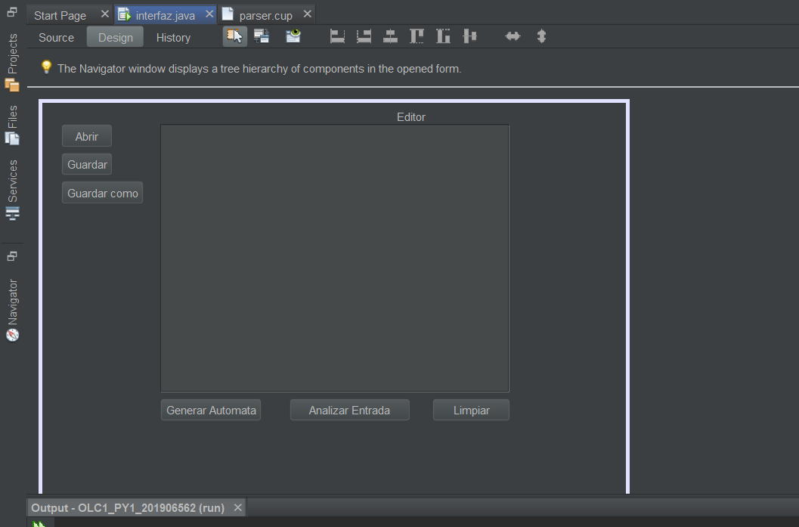

# **MANUAL DE TECNICO**


## Simple C

## **INDICE**
- [**MANUAL DE TECNICO**](#manual-de-tecnico)
  - [Simple C](#simple-c)
  - [**INDICE**](#indice)
  - [**SOBRE EL PROGRAMA**](#sobre-el-programa)
  - [**CONOCIMIENTOS PREVIOS**](#conocimientos-previos)
  - [**ESPECIFICACIONES TECNICAS**](#especificaciones-tecnicas)
  - [**FUNCIONES DEL CODIGO**](#funciones-del-codigo)

## **SOBRE EL PROGRAMA**
El progama tiene como objetivo de leer un archivo de extension .olc, el contendido del archivo estara dado por un lenguaje de programacion, donde sera aplicado nuestro analizador lexico y sintactico, permitiendo la generacion de arboles ABL, Tablas siguientes, Tablas de transciones, Automata AFD y Automata AFND

## **CONOCIMIENTOS PREVIOS**
Los conocimientos mínimos que deben tener las personas que operarán las páginas y deberán utilizar este manual son:
- Conocimientos básicos de JAVA
- Conocimientos básicos de Jflex
- Conocimientos básicos de cup
- Conocimientos básicos en editor de texto Neatbeans.
- Conocimiento básico de HTML
- Conocimiento básico de Framework (Bootstrap)
- Conocimiento básico gramaticas
- Conocimiento básico Json
- Conocimiento básico Graphviz

## **ESPECIFICACIONES TECNICAS**
Se debe cumplir con los siguientes requisitos antes de usar el programa.

- **Sistema operativo:** windows 7, 8, 8.1 o 10 u otro sistema operativo que permita usar python 
- **Lenguaje de programacion:** Java
- **Editor de codigo:** Visual Studio Code, Neatbeans, etc...
- **Navegador web:** : Cualquier versión de Google Chrome 
- **Archivo Jflex y cup:** : Se debera tener la version de 3.11 u otro 

## **FUNCIONES DEL CODIGO**
A continuacion se estara detallando los manejos de codigo que se requirieron para el desarrollo de nuestro programa

Se abre nuestro programa desde Neatbeans

teniendo como primer paso nuestro Interfaz


Se modifican los codigos de botones para reaizar eventos para el manejo de los archivos

- ### **CODIGO INTERFAZ.JAVA**
  Se inportan las librerias a utilizar para nuestro interfaz
  ``` java
    import analizador.parser;
    import analizador.scanner;
    import java.io.BufferedWriter;

    import java.io.File;
    import java.io.FileWriter;
    import java.io.PrintWriter;
    import java.nio.Buffer;
    import java.nio.charset.StandardCharsets;
    import java.util.Scanner;
    import javax.swing.JFileChooser;
    import javax.swing.JOptionPane;

    import java.io.FileWriter;
    import java.io.IOException;
    import org.json.simple.JSONArray;
    import org.json.simple.JSONObject;

  ```
  Se crea el evento de nuestro boton de abrir

  ``` java
   private void btn_abrirActionPerformed(java.awt.event.ActionEvent evt) {                                          
        JFileChooser fileChooser = new JFileChooser();
        int seleccion = fileChooser.showSaveDialog(txt_editor);
        if (seleccion == JFileChooser.APPROVE_OPTION) {
            fichero_actual = fileChooser.getSelectedFile();
            String contenido = "";

            try {
                Scanner input = new Scanner(fichero_actual);
                while (input.hasNextLine()) {
                    contenido += input.nextLine() + "\n";

                }
                input.close();

            } catch (Exception e) {
                e.printStackTrace();
            }
            txt_editor.setText(contenido);
        }
    }                                         

  ```

  Se crea el evento de nuestro boton de guardar
  ```java
    private void btn_guardarActionPerformed(java.awt.event.ActionEvent evt) {                                            
            File file = fichero_actual;
            String text = txt_editor.getText();

            try (PrintWriter out = new PrintWriter(file, StandardCharsets.UTF_8)) {
                out.print(text);
                System.out.println("Se guardo el archivo con exito");

            } catch (Exception e) {
                e.printStackTrace();
            }
    }     

  ```


  Se crea el evento de guardar como
  ```java
  private void btn_guardarcomoActionPerformed(java.awt.event.ActionEvent evt) {                                                
        JFileChooser guardarcomo = new JFileChooser();
        guardarcomo.showSaveDialog(null);
        guardarcomo.setFileSelectionMode(JFileChooser.FILES_AND_DIRECTORIES);

        File archivo = new File(guardarcomo.getSelectedFile() + ".olc");

        try {
            BufferedWriter salida = new BufferedWriter(new FileWriter(archivo));
            salida.write(txt_editor.getText());
            salida.close();
        } catch (Exception e) {
            System.out.println("Error al guardar");
            e.printStackTrace();
        }
    }    
  ```

  Evento donde del boton de analizar
  ``` java
  private void btn_AnalizarActionPerformed(java.awt.event.ActionEvent evt) {                                             
        JSONArray Lista_Analiza = new JSONArray();

        for (int i = 0; i < ParserGlobal.Iden_Lexema.size(); i++) {
            JSONObject Datos_Analizar = new JSONObject();
            Datos_Analizar.put("Valor", ParserGlobal.Iden_Lexema.get(i).getExp_Regular());
            Datos_Analizar.put("ExpresionRegular", ParserGlobal.Iden_Lexema.get(i).getValor());
            Datos_Analizar.put("Resutado",ParserGlobal.Iden_Lexema.get(i).getResultado());
            
            Lista_Analiza.add(Datos_Analizar);
        }
        
        try {

            FileWriter file = new FileWriter("SALIDAS_201906562\\Salida.json");
            file.write(Lista_Analiza.toJSONString());
            file.flush();
            file.close();

        } catch (IOException e) {
            //manejar error
        }

    }                                            

  ```

- ### **ARBOL_AUTOMATA.JAVA**
  Se importan las librerias

  ```java
    import java.awt.Desktop;
    import java.io.File;
    import java.io.FileWriter;
    import java.io.IOException;
    import java.io.PrintWriter;
    import java.util.ArrayList;
    import javax.xml.transform.Source;
  ```
  Se crea nuestro constructor y la llamada de nuestro metodos

  ``` java
  public class Arbol_automata {

    private Nodo_automata arbol_exp;
    private String nombre_expresion;
    private int num_nodo = 1;
    private int num_estado = 0;
    public ArrayList<Tabla_Sig> Tablas_sig = new ArrayList<>();
    public ArrayList<String> Terminales = new ArrayList<>();
    public ArrayList<Nodo_Estado> Tabla_Transiciones = new ArrayList<>();

    public Arbol_automata(Nodo_automata arbol_exp, String nombre) {
        Nodo_automata raiz = new Nodo_automata(".");
        Nodo_automata aceptacion = new Nodo_automata("#");
        aceptacion.setHoja(true);
        aceptacion.setAnulable(false);
        raiz.setHijo_der(aceptacion);
        raiz.setHijo_izq(arbol_exp);

        this.arbol_exp = raiz;
        this.nombre_expresion = nombre;

        asignar_identificador(this.arbol_exp);
        construccion_arbol(this.arbol_exp);
        tabla(this.arbol_exp, num_nodo);
        GraficarGrap_GenerarDot(crear_Tabla_sig(), "SIGUIENTES_201906562\\", "ExpReg-" + this.nombre_expresion);
        Crear_Terminales();
        Crear_Transiciones();
        GraficarGrap_GenerarDot(Crear_Tabla_Transicion(), "TRANSICIONES_201906562\\", "ExpReg-" + this.nombre_expresion);
        
        GraficarGrap_GenerarDot(Crear_AFD(),"AFD_201906562\\", "ExpReg-" + this.nombre_expresion);
        num_nodo = 0;
        GraficarGrap_GenerarDot("digraph test {\n" + crear_arbol(this.arbol_exp, num_nodo) + "}", "ARBOLES_201906562\\", "ExpReg-" + this.nombre_expresion);

    }

  ```
  Se crea el el metodo para la asignacion de identicadores de nuestro arbol ABL

  ``` java
    public void asignar_identificador(Nodo_automata actual) {

        if (actual == null) {
            return;
        }

        if (actual.isHoja()) {
            actual.setIdentificador(num_nodo);
            num_nodo++;
            return;
        }

        asignar_identificador(actual.getHijo_izq());
        asignar_identificador(actual.getHijo_der());
    }
  ```
  Se crea el metodo para la asignacion de los primeros ultimos y si es anulable

  ``` java 
  public void construccion_arbol(Nodo_automata actual) {

        if (actual == null) {
            return;
        }

        if (actual.isHoja()) {
            actual.getPrimeros().add(actual.getIdentificador());
            actual.getUltimos().add(actual.getIdentificador());
            return;

        }

        construccion_arbol(actual.getHijo_izq());
        construccion_arbol(actual.getHijo_der());

        if (actual.getDato().equals("*")) {
            actual.setAnulable(true);
            actual.getPrimeros().addAll(actual.getHijo_izq().getPrimeros());
            actual.getUltimos().addAll(actual.getHijo_izq().getUltimos());
        } else if (actual.getDato().equals("+")) {
            actual.setAnulable(actual.getHijo_izq().isAnulable());
            actual.getPrimeros().addAll(actual.getHijo_izq().getPrimeros());
            actual.getUltimos().addAll(actual.getHijo_izq().getUltimos());
        } else if (actual.getDato().equals("?")) {
            actual.setAnulable(true);
            actual.getPrimeros().addAll(actual.getHijo_izq().getPrimeros());
            actual.getUltimos().addAll(actual.getHijo_izq().getUltimos());
        } else if (actual.getDato().equals("|")) {
            actual.setAnulable(actual.getHijo_izq().isAnulable() || actual.getHijo_der().isAnulable());
            actual.getPrimeros().addAll(actual.getHijo_izq().getPrimeros());
            actual.getPrimeros().addAll(actual.getHijo_der().getPrimeros());
            actual.getUltimos().addAll(actual.getHijo_izq().getUltimos());
            actual.getUltimos().addAll(actual.getHijo_der().getUltimos());
        } else if (actual.getDato().equals(".")) {
            actual.setAnulable(actual.getHijo_izq().isAnulable() && actual.getHijo_der().isAnulable());
            if (actual.getHijo_izq().isAnulable()) {
                actual.getPrimeros().addAll(actual.getHijo_izq().getPrimeros());
                actual.getPrimeros().addAll(actual.getHijo_der().getPrimeros());
            } else {
                actual.getPrimeros().addAll(actual.getHijo_izq().getPrimeros());
            }

            if (actual.getHijo_der().isAnulable()) {
                actual.getUltimos().addAll(actual.getHijo_izq().getUltimos());
                actual.getUltimos().addAll(actual.getHijo_der().getUltimos());
            } else {
                actual.getUltimos().addAll(actual.getHijo_der().getUltimos());
            }

        }

    }
  ```
  Metodo para crar nuestro arbol en formato de Graphviz

  ``` java  
  public String crear_arbol(Nodo_automata actual, int padre) {
        String content = "";
        num_nodo += 1;

        int number = num_nodo;

        if (actual == null) {
            num_nodo -= 1;
            return content;
        }

        if (actual.isHoja()) {
            content += "N_" + number + "[shape = none label=<\n"
                    + " <TABLE border=\"1\" cellspacing=\"2\" cellpadding=\"10\" >\n"
                    + " <TR>\n"
                    + " <TD colspan=\"3\">" + actual.isAnulable() + "</TD>\n"
                    + " </TR>\n"
                    + " <TR>\n"
                    + " <TD>" + actual.getPrimeros() + "</TD>\n"
                    + " <TD>" + actual.getDato() + "</TD>\n"
                    + " <TD>" + actual.getUltimos() + "</TD>\n"
                    + " </TR>\n"
                    + " <TR>\n"
                    + " <TD colspan=\"3\">" + actual.getIdentificador() + "</TD>\n"
                    + " </TR>\n"
                    + " </TABLE>>];";
        } else {
            content += "N_" + number + "[shape = none label=<\n"
                    + " <TABLE border=\"1\" cellspacing=\"2\" cellpadding=\"10\" >\n"
                    + " <TR>\n"
                    + " <TD colspan=\"3\">" + actual.isAnulable() + "</TD>\n"
                    + " </TR>\n"
                    + " <TR>\n"
                    + " <TD>" + actual.getPrimeros() + "</TD>\n"
                    + " <TD>" + actual.getDato() + "</TD>\n"
                    + " <TD>" + actual.getUltimos() + "</TD>\n"
                    + " </TR>\n"
                    + " </TABLE>>];";
        }

        if (padre != 0) {
            content += "N_" + padre + " -> N_" + number + ";\n";
        }

        content += crear_arbol(actual.getHijo_izq(), number);
        content += crear_arbol(actual.getHijo_der(), number);

        return content;
    }

  ```
  Metodo para crear nuestra tabla siguiente en formato graphviz

  ``` java
  public String crear_Tabla_sig() {
        String content = "digraph G {\n"
                + "label     = \"TABLA DE SIGUIENTES\"\n"
                + "labelloc  =  t // t: Place the graph's title on top.\n"
                + "fontsize  = 30 // Make title stand out by giving a large font size \n"
                + "fontcolor = blue\n"
                + "N_1[shape = none label=<\n"
                + "<TABLE border=\"1\" cellspacing=\"2\" cellpadding=\"10\" >\n"
                + "<TR>\n"
                + "<TD colspan=\"2\" width=\"200\">Hoja</TD>\n"
                + "<TD colspan=\"1\" width=\"150\">Siguintes</TD>\n"
                + "</TR>\n";

        for (int i = 0; i < Tablas_sig.size(); i++) {
            content += "<TR>\n"
                    + " <TD>" + Tablas_sig.get(i).getDato() + "</TD>\n"
                    + " <TD>" + Tablas_sig.get(i).getNodo() + "</TD>\n"
                    + " <TD>" + Tablas_sig.get(i).getSiguientes() + "</TD>\n"
                    + " </TR>\n";
        }

        content += "</TABLE>>]\n"
                + "}";

        return content;

    }
  ```

  Metodo para crear arbol de transciones
  ``` java
   public String Crear_AFD() {
        String content = "digraph finite_state_machine {\n"
                + "fontname=\"Helvetica,Arial,sans-serif\"\n"
                + "node [fontname=\"Helvetica,Arial,sans-serif\"]\n"
                + "edge [fontname=\"Helvetica,Arial,sans-serif\"]\n"
                + "rankdir=LR;\n"
                + "nodesep=0.5;\n"
                + "node [shape = circle width = \"1.2\"]\n"
                + "S[shape=plaintext, label= \"\"]\n";

        for (int i = 0; i < Tabla_Transiciones.size(); i++) {

            if (Tabla_Transiciones.get(i).isAceptacion()) {
                content += Tabla_Transiciones.get(i).getEstado() + "[shape = doublecircle]\n";

            } else {
                content += Tabla_Transiciones.get(i).getEstado() + "\n";
            }
        }
        
        content += "S -> S0 [label = \"Inicio\"];\n";

        for (int i = 0; i < Tabla_Transiciones.size(); i++) {
            for (int j = 0; j < Terminales.size(); j++) {

                if (!Tabla_Transiciones.get(i).getList_Transiciones().get(j).equals("--")) {
                    content += Tabla_Transiciones.get(i).getEstado() + " -> " + Tabla_Transiciones.get(i).getList_Transiciones().get(j);
                    String text = Terminales.get(j).replace("\"", "");
                    text = text.replace("\\", "\\" + "\\");
                    content += " [label = \"" + text + "\"];\n";

                }

            }

        }

        content += "}";

        return content;
    }
  ```

  Metodo para generar nuestros archivos dot y png

  ```java 
   private void GraficarGrap_GenerarDot(String cadena, String carpeta, String nombre) {
        FileWriter fichero = null;
        PrintWriter escritor = null;
        try {
            fichero = new FileWriter(carpeta + nombre + ".dot");
            escritor = new PrintWriter(fichero);
            escritor.println(cadena);
            escritor.close();
            fichero.close();
            reportar(carpeta, nombre);
        } catch (Exception e) {
            System.out.println("error en generar dot");
            e.printStackTrace();
        }
    }

    public void reportar(String carpeta, String nombre) throws IOException {

        String file_input_path = carpeta + nombre + ".dot";
        String do_path = "C:\\Program Files\\Graphviz\\bin\\dot.exe";

        String file_get_path = carpeta + nombre + ".jpg";
        try {
            ProcessBuilder pBuilder;
            pBuilder = new ProcessBuilder(do_path, "-Tjpg", "-o", file_get_path, file_input_path);
            pBuilder.redirectErrorStream(true);
            pBuilder.start();
        } catch (Exception ex) {
            ex.printStackTrace();
        }
    }
  ```

  - #### NODO_AUTOMATA.JAVA
    Se crean las variables
    ```java
     private String dato;
    private Nodo_automata hijo_izq;
    private Nodo_automata hijo_der;
    private boolean hoja = false;
    private int identificador;
    private boolean anulable;
    private ArrayList<Integer> primeros = new ArrayList<>();
    private ArrayList<Integer> ultimos = new ArrayList<>();
    
    
    ```
    Se creo el contructor y sus getters y setters

    ```java
    public Nodo_automata(String dato) {
        this.dato = dato;
    }

    public ArrayList<Integer> getUltimos() {
        return ultimos;
    }

    public void setUltimos(ArrayList<Integer> ultimos) {
        this.ultimos = ultimos;
    }

    public boolean isAnulable() {
        return anulable;
    }

    public ArrayList<Integer> getPrimeros() {
        return primeros;
    }

    public void setPrimeros(ArrayList<Integer> primeros) {
        this.primeros = primeros;
    }

    public void setAnulable(boolean anulable) {
        this.anulable = anulable;
    }

    public String getDato() {
        return dato;
    }

    public int getIdentificador() {
        return identificador;
    }

    public void setIdentificador(int identificador) {
        this.identificador = identificador;
    }
    

    public void setDato(String dato) {
        this.dato = dato;
    }
    
    

    public Nodo_automata getHijo_izq() {
        return hijo_izq;
    }

    public void setHijo_izq(Nodo_automata hijo_izq) {
        this.hijo_izq = hijo_izq;
    }

    public Nodo_automata getHijo_der() {
        return hijo_der;
    }

    public void setHijo_der(Nodo_automata hijo_der) {
        this.hijo_der = hijo_der;
    }

    public boolean isHoja() {
        return hoja;
    }

    public void setHoja(boolean hoja) {
        this.hoja = hoja;
    }
    
    ```


    