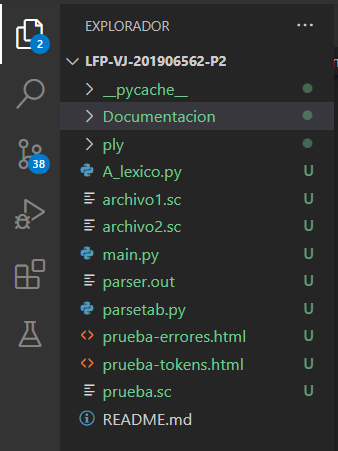

# **MANUAL DE TECNICO**


## Simple C

## **INDICE**
  - [**INDICE**](#indice)
  - [**SOBRE EL PROGRAMA**](#sobre-el-programa)
  - [**CONOCIMIENTOS PREVIOS**](#conocimientos-previos)
  - [**ESPECIFICACIONES TECNICAS**](#especificaciones-tecnicas)
  - [**FUNCIONES DEL CODIGO**](#funciones-del-codigo)

## **SOBRE EL PROGRAMA**
El progama tiene como objetivo de leer un archivo de extension .sc, el contendido del archivo estara dado por la estructura de un codigo realizo en el lenguaje C o C++, donde se estara dando un reporte de tokens lexicos, un AST y reporte de errores lexicos y sintacticos, sobre el analisis del codigo leido en el archivo.

## **CONOCIMIENTOS PREVIOS**
Los conocimientos mínimos que deben tener las personas que operarán las páginas y deberán utilizar este manual son:
- Conocimientos básicos de python
- Conocimientos básicos en Visual Studio Code.
- Conocimiento básico de HTML
- Conocimiento básico de Framework (Bootstrap)
- Conocimiento básico PLY(lex y yacc)
- Conocimiento básico gramaticas

## **ESPECIFICACIONES TECNICAS**
Se debe cumplir con los siguientes requisitos antes de usar el programa.

- **Sistema operativo:** windows 7, 8, 8.1 o 10 u otro sistema operativo que permita usar python 
- **Lenguaje de programacion:** Python y Framework (Bootstrap 2.8)
- **Editor de codigo:** Visual Studio Code, Atom, Pycharm, Nano, etc...
- **Navegador web:** : Cualquier versión de Google Chrome 
- **Archivo PLY:** : Se debera tener la version de 3.11 u otro 

## **FUNCIONES DEL CODIGO**
A continuacion se estara detallando los manejos de codigo que se requirieron para el desarrollo de nuestro programa

Se abre nuestro editor de codigo (VSC)


Procedeos a abrir la carpeta donde contenemos nuestro codigo


podremos ver en la pantalla de lado izquierdo lo siguiente



- ### **CODIGO MAIN.PY**
  En este apartado tendremos la primera visualizacion de nuestro programa, donde nos tendra el menu que se tendra para el manejo de las opciones que el usuario elija

  ``` python
  import A_lexico

    def Aplicacion():
        salir=False

        while not salir:
            print(
    '''
    -----------MENU-----------
    1. Archivo
    2. Nombre del archivo
    3. salir
    ''')
            opcion=input("=>")
            if opcion=="1":
                directorio=input("Ingrese el directorio del archivo \n>> ")
                
                try:
                    archivo=open(directorio, encoding="utf8").read()
                    A_lexico.run(archivo)
                    print("Archivo leido con exito!")
                except:
                    print("\nArchivo no encontrado!\n")     

            elif opcion=="2":
                nombre = input("Ingrese nombre del archivo \n>> ")
                A_lexico.GenerarHTML(nombre)
                print("Reporte generado con exito!")
            elif opcion == "3":
                salir = True
                print("Fin del programa!")
            else:
                print("Opcion no valida!")

    Aplicacion()
  ```

- ### **CODIGO ANALIZADOR.PY**
  En este apartado tendremos la parte mas importante para el analisis lexico y sintactico del archivo

  Se tiene implementado nuestro analizador lexico

  ``` python
    from ply.lex import lex

    def getColumn(t):
    line_start = INPUT.rfind('\n', 0, t.lexpos) + 1
    return (t.lexpos-line_start)+1

    # Tokens

    reserved = {
    'int' : 'private_int',
    'double' : 'private_double',
    'string' : 'private_string',
    'char' : 'private_char',
    'boolean' : 'private_boolean',
    'if' : 'private_if',
    'else' : 'private_else',
    'while' : 'private_while',
    'do' : 'private_do',
    'void' : 'private_void',
    'return' : 'private_return',
    'true' : 'private_true',
    'false' : 'private_false',
    'break' : 'private_break',
    'continue' : 'private_continue',
    }

    patrones = {
    '+':'oper_suma',
    '-': 'oper_resta',
    '*': 'oper_multiplicacion',
    '/': 'oper_division',
    '%': 'oper_resto',
    '==': 'oper_igualacion',
    '!=': 'oper_diferenciacion',
    '>': 'oper_mayor',
    '>=': 'oper_mayor_igual',
    '<': 'oper_menor',
    '<=': 'oper_menor_igual',
    '&&': 'oper_and',
    '||': 'oper_or',
    '!': 'oper_not',
    ';': 'ptcoma',
    '=': 'asignacion',
    '{': 'llave_a',
    '}': 'llave_b',
    '(': 'par_a',
    ')': 'par_b',
    ',': 'coma',
    'd+': 'entero',
    'd+.d+': 'decimal',
    '".*?"': 'cadena',
    "'.*?'": 'char',
    '[a-zA-Z_][a-zA-Z_0-9]*': 'identificador',
    }


    tokens = tuple(patrones.values()) + tuple(reserved.values())

    t_private_int = 'int'
    t_private_double = 'double'
    t_private_string = 'string'
    t_private_char = 'char'
    t_private_boolean = 'boolean'
    t_private_if = 'if'
    t_private_else = 'else' 
    t_private_while = 'while'
    t_private_do = 'do'
    t_private_void = 'void'
    t_private_return = 'return'
    t_private_true = 'true'
    t_private_false = 'false'
    t_private_break = 'break'
    t_private_continue = 'continue'
    t_oper_suma = r'\+'
    t_oper_resta = r'-'
    t_oper_multiplicacion = r'\*' 
    t_oper_division = r'/'
    t_oper_resto = r'%'
    t_oper_igualacion = r'=='
    t_oper_diferenciacion = r'!='
    t_oper_mayor = r'>'
    t_oper_mayor_igual = r'>='
    t_oper_menor = r'<'
    t_oper_menor_igual = r'<='
    t_oper_and = r'&&'
    t_oper_or = r'\|\|'
    t_oper_not = r'!'
    t_ptcoma = r';'
    t_asignacion = r'='
    t_llave_a = r'{'
    t_llave_b = r'}'
    t_par_a = r'\('
    t_par_b = r'\)'
    t_coma = r','
    t_entero = r'\d+'
    t_decimal = r'\d+\.\d+'

    # Lexemas ignorados
    t_ignore = ' \t\r\n'

    def t_cadena(t): 
    r'\".*?\"'
    t.value = t.value.strip('"')
    return t

    def t_char(t):
    r'\'.*?\''
    t.value = t.value.strip("'")
    return t


    def t_identificador(t):
    r'[a-zA-Z_][a-zA-Z_0-9]*'
    if t.value.lower() in reserved.keys(): t.type = reserved[t.value.lower()]
    return t

    def t_coment_simple(t):
    r'//.*\n'
    t.lexer.lineno += 1


    def t_coment_Multi(t):
    r'/\*(.|\n)*?\*/'
    t.lexer.lineno += t.value.count('\n')

    def t_newline(t):
    r'\n+'
    t.lexer.lineno+=len(t.value)

    tabla_errores = ''


    def t_error(t):
    global tabla_errores

    tabla_errores +='''
                    <tr>
                    <td> ''' + str(t.lineno) + ''' </td>
                    <td> ''' + str(t.lexpos) + ''' </td>
                    <td> ''' + str("Lexema") + ''' </td>
                    <td> No se pudo reconocer el lexema ''' + str(t.value[0]) + ''' </td>
                    </tr>
                    '''
    t.lexer.skip(1)
  ```

  Contando ya con nuestro analisador lexico, procedemos con nuestro analizar sintactico, antes de entrar de lleno se debera conocer sobre nuestras gramaticas implementados que son los siguientes


  - #### **Gramática de Simple MAT**
    - **Alfabeto**
     
        **Simbolos terminales**
        ==

        Expresiones regulares
        =
        | Token               |         Patrón         |
        | ------------------- | :--------------------: |
        | oper_suma           |           +            |
        | oper_resta          |           -            |
        | oper_multiplicacion |           *            |
        | oper_division       |           /            |
        | oper_resto          |           %            |
        | oper_igualacion     |           ==           |
        | oper_diferenciacion |           !=           |
        | oper_mayor          |           >            |
        | oper_mayor_igual    |           >=           |
        | oper_menor          |           <            |
        | oper_menor_igual    |           <=           |
        | oper_and            |           &&           |
        | oper_or             |         \| \|          |
        | oper_not            |           !            |
        | ptcoma              |           ;            |
        | asignacion          |           =            |
        | llave_a             |           {            |
        | llave_b             |           }            |
        | par_a               |           (            |
        | par_b               |           )            |
        | coma                |           ,            |
        | entero              |           d+           |
        | decimal             |         d+.d+          |
        | cadena              |         ".*?"          |
        | char                |         '.*?'          |
        | identificador       | [a-zA-Z_][a-zA-Z_0-9]* |

        Palabras Reservadas
        ==
        | Token            |  Patrón  |
        | ---------------- | :------: |
        | private_int      |   int    |
        | private_double   |  double  |
        | private_string   |  string  |
        | private_char     |   char   |
        | private_boolean  | boolean  |
        | private_if       |    if    |
        | private_else     |   else   |
        | private_while    |  while   |
        | private_do       |    do    |
        | private_void     |   void   |
        | private_return   |  return  |
        | private_true     |   true   |
        | private_false    |  false   |
        | private_break    |  break   |
        | private_continue | continue |

        Simbolos no terminales
        =
        | Token             | Descripcion                    |
        | ----------------- | ------------------------------ |
        | CODIGO            | Estado inicial de la sintáxis  |
        | INTRUCCION        | lista de intrucciones          |
        | INSTRUCCIONES     | cualquier instruccion          |
        | DEC_VAR           | declaracion de variables       |
        | ASIG_VAR          | asignacion de variables        |
        | EST_CONDICIONALES | condicionales                  |
        | EST_ITERATIVAS    | bucles                         |
        | SENT_CFLUJO       | sentencias de flujos           |
        | DEC_METODOS       | metodos                        |
        | DEC_FUNCIONES     | funciones                      |
        | RETORNO           | retorno de funcioens y metodos |
        | LLAMADA           | llamada de funciones y metodos |
        | TIPO_DATO         | tipo de dato                   |
        | DATO              | dato                           |
        | OPERACION         | cualquier operacion            |
        | PARAMETROS        | uno o ningun parametro         |
        | ARGUMENTOS        | uno o ningun arguemnto         |
    - **Sintaxis**
 
        **Presedencia**
        =
        presedencia de operaciones de mas o menos:
        | Precedencia | perador                                    | Asociatividad |
        | :---------: | ------------------------------------------ | ------------- |
        |     11      | Agrupacion                                 | Ninguna       |
        |     10      | Acceso a arreglo                           | Izquierda     |
        |      9      | Llamada a función                          | Izquierda     |
        |      8      | Negación unaria, not                       | Derecha       |
        |      7      | Potencia                                   | Derecha       |
        |      6      | Multiplicación, división, módulo           | Izquierda     |
        |      5      | Suma, resta                                | Izquierda     |
        |      4      | Menor, menor o igual, mayor, mayor o igual | Izquierda     |
        |      3      | Igualación, diferenciación                 | Izquierda     |
        |      2      | And                                        | Izquierda     |
        |      1      | Or                                         | Izquierda     |

        **Producciones**
        =
        ```ru
        Simbolo inicial = CODIGO

        CODIGO : CONTENIDO 

        CONTENIDO : CONTENIDO INSTRUCCIONES
                  | INSTRUCCIONES

        INSTRUCCIONES : DEC_VAR
                      | ASIG_VAR
                      | EST_CONDICIONALES
                      | EST_ITERATIVAS       
                      | SENT_CFLUJO
                      | DEC_METODOS
                      | DEC_FUNCIONES
                      | RETORNO
                      | LLAMADA

        DEC_VAR : TIPO_DATO identificador asignacion DATO ptcoma

        TIPO_DATO : private_int
                  | private_double
                  | private_string
                  | private_char
                  | private_boolean

        DATO : entero
             | decimal
             | cadena
             | char
             | private_true
             | private_false
        
        ASIG_VAR : identificador asignacion DATO ptcoma

        EST_CONDICIONALES : private_if par_a OPERACION par_b llave_a INSTRUCCIONS llave_b
                          | private_if par_a OPERACION par_b llave_a INSTRUCCIONS llave_b private_else llave_a INSTRUCCIONS llave_b
        
        OPERACION : OPERACION E
                  | E
  
        E : E oper_suma E
          | E oper_resta E
          | E oper_multiplicacion E
          | E oper_division E
          | E oper_resto E
          | E oper_igualacion E
          | E oper_diferenciacion E
          | E oper_mayor E
          | E oper_mayor_igual E
          | E oper_menor E
          | E oper_menor_igual E
          | E oper_and E
          | E oper_or E
          | oper_not E
          | identificador
          | entero
          | private_false
          | private_true

        INSTRUCCIONS : INSTRUCCIONS INSTRUCCIONES2
                     | INSTRUCCIONES2

        INSTRUCCIONES2 : DEC_VAR
                       | ASIG_VAR
                       | EST_CONDICIONALES
                       | EST_ITERATIVAS       
                       | SENT_CFLUJO
                       | RETORNO
                       | LLAMADA

        EST_ITERATIVAS : private_while par_a OPERACION par_b llave_a INSTRUCCIONS llave_b
                       | private_do llave_a INSTRUCCIONS llave_b private_while par_a OPERACION par_b ptcoma

        SENT_CFLUJO : private_break ptcoma
                    | private_continue ptcoma

        DEC_METODOS : private_void identificador par_a PARAMETROS par_b llave_a INSTRUCCIONS llave_b
                    | private_void identificador par_a par_b llave_a INSTRUCCIONS llave_b

        PARAMETROS : PARAMETROS coma TIPO_DATO identificador
                   | TIPO_DATO identificador
  
        DEC_FUNCIONES : TIPO_DATO identificador par_a PARAMETROS par_b llave_a INSTRUCCIONS llave_b
                      | TIPO_DATO identificador par_a par_b llave_a INSTRUCCIONS llave_b

        RETORNO : private_return ptcoma
                | private_return DATO ptcoma
  
        LLAMADA : identificador par_a ARGUMENTOS par_b 
                | identificador par_a par_b
        
        ARGUMENTOS : ARGUMENTOS coma DATO
                   | DATO
        ```


  - #### Precedencia
    ``` python
    precedence = (
        ('left','oper_or'),
        ('left','oper_and'),
        ('left','oper_igualacion','oper_diferenciacion'),
        ('left','oper_menor','oper_mayor','oper_menor_igual','oper_mayor_igual'),
        ('left','oper_suma','oper_resta'),
        ('left','oper_multiplicacion','oper_division','oper_resto'),
        ('left','oper_not')
        )
    ```
  - #### Gramatica de inicio
    ``` python
    def p_CODIGO(p):
        '''
        CODIGO : CONTENIDO 
        '''
        p[0] = p[1]
    ```

  - #### Gramatica instruccion
    ``` python
    def p_CONTENIDO(p):
        '''
        CONTENIDO : CONTENIDO INSTRUCCIONES
                    | INSTRUCCIONES
        '''
        if len(p)==3:
            p[0] = p[1]
            p[0].append(p[2])
        else:
            p[0] = [p[1]]
    ```

  - #### Gramatica Instrucciones
    ```python
    def p_INSTRUCCIONES(p):
        '''
        INSTRUCCIONES : DEC_VAR
                        | ASIG_VAR
                        | EST_CONDICIONALES
                        | EST_ITERATIVAS       
                        | SENT_CFLUJO
                        | DEC_METODOS
                        | DEC_FUNCIONES
                        | RETORNO
                        | LLAMADA
        '''
        p[0] = p[1]
    ```
  - #### Gramatica de declaracion de variables
    ``` python
    def p_DEC_VAR(p):
        '''
        DEC_VAR : TIPO_DATO identificador asignacion DATO ptcoma
        '''
        p[0] = [p[1]]
        p[0].append(p[4])
    ```
  - #### Gramatica de tipo de dato
    ``` python
    def p_TIPO_DATO(p):
        '''
        TIPO_DATO : private_int
                    | private_double
                    | private_string
                    | private_char
                    | private_boolean
        '''
        p[0] = p[1]
    ```
  - #### Gramatica dato
    ``` python
    def p_DATO(p):
        '''
        DATO : entero
                | decimal
                | cadena
                | char
                | private_true
                | private_false
        '''
        p[0] = p[1]
    ```
  - #### Gramatica de asignacion de variables
    ``` python
    def p_ASIG_VAR(p):
        '''
        ASIG_VAR : identificador asignacion DATO ptcoma
        '''
        p[0] = [p[3]]
    ```
  - #### Gramatica de estructuras condicionales (if)
    ``` python 
    def p_EST_CONDICIONALES(p):
        '''
        EST_CONDICIONALES : private_if par_a OPERACION par_b llave_a INSTRUCCIONS llave_b
                            | private_if par_a OPERACION par_b llave_a INSTRUCCIONS llave_b private_else llave_a INSTRUCCIONS llave_b
        '''
        if len(p)==8:
            p[0] = [p[3]]
            p[0].append(p[6])
        else:
            p[0] = [p[3]]
            p[0].append(p[6])
            p[0].append(p[10])
    ```
  - #### Gramatica de operaciones
    ``` python
    def p_OPERACION(p):
        '''
        OPERACION : OPERACION E
                    | E
        '''
        if len(p)==3:
            p[0] = p[1]
            p[0].append(p[2])
        else:
            p[0] = p[1]

        def p_E(p):
        '''
        E : E oper_suma E
            | E oper_resta E
            | E oper_multiplicacion E
            | E oper_division E
            | E oper_resto E
            | E oper_igualacion E
            | E oper_diferenciacion E
            | E oper_mayor E
            | E oper_mayor_igual E
            | E oper_menor E
            | E oper_menor_igual E
            | E oper_and E
            | E oper_or E
            | oper_not E
            | identificador
            | entero
            | private_false
            | private_true
        '''
        if len(p)==3:
            p[0] = {"linea": p.lexer.lineno, "columna": getColumn(p.lexer), "operacion": p[1], "derecha": p[2]}
        elif len(p)==2:
            p[0] = {"linea": p.lexer.lineno, "columna": getColumn(p.lexer), "valor": p[1]}
        else:
            p[0] = {"linea": p.lexer.lineno, "columna": getColumn(p.lexer), "operacion": p[2], "izquierda": p[1], "derecha": p[3]}

    ```
  - #### Gramatica de instrucciones sin metodos y funciones
    ```python
    def p_INSTRUCCIONS(p):
        '''
        INSTRUCCIONS : INSTRUCCIONS INSTRUCCIONES2
                    | INSTRUCCIONES2
        '''
        if len(p)==3:
            p[0] = p[1]
            p[0].append(p[2])
        else:
            p[0] = [p[1]]

        def p_INSTRUCCIONES2(p):
        '''
        INSTRUCCIONES2 : DEC_VAR
                        | ASIG_VAR
                        | EST_CONDICIONALES
                        | EST_ITERATIVAS       
                        | SENT_CFLUJO
                        | RETORNO
                        | LLAMADA
        '''
        
        p[0] = p[1]

    ```
  - #### Gramatica de iteraciones (bucles while-do while)
    ```python 
    def p_EST_ITERATIVAS(p):
        '''
        EST_ITERATIVAS : private_while par_a OPERACION par_b llave_a INSTRUCCIONS llave_b
                            | private_do llave_a INSTRUCCIONS llave_b private_while par_a OPERACION par_b ptcoma
        '''
        
        if len(p)==8:
            p[0] = [p[3]]
            p[0].append(p[6])
        else:
            p[0] = [p[3]]
            p[0].append(p[7])
    
    ```
  - #### Gramatica de sentencias de flujo
    ```python
    def p_SENT_CFLUJO(p):
        '''
        SENT_CFLUJO : private_break ptcoma
                    | private_continue ptcoma
        '''
        p[0] = [p[1]]
    ```
  - #### Gramatica de declaracion de metodos
    ```python 
    def p_DEC_METODOS(p):
        '''
        DEC_METODOS : private_void identificador par_a PARAMETROS par_b llave_a INSTRUCCIONS llave_b
                    | private_void identificador par_a par_b llave_a INSTRUCCIONS llave_b
        '''

        if len(p)==9:
            p[0] = [p[4]]
            p[0].append(p[7])
        else:
            p[0] = [p[6]]
    ```
  - #### Gramatica de parametros
    ```python
    def p_PARAMETROS(p):
        '''
        PARAMETROS : PARAMETROS coma TIPO_DATO identificador
                    | TIPO_DATO identificador
        '''
        if len(p)==5:
            p[0] = p[1]
            p[0].append(p[3])
            p[0].append(p[4])
        else:
            p[0] = [p[1]]
            p[0].append(p[2])
    ```
  - #### Gramatica de declaracion de funciones
    ```python
    def p_DEC_FUNCIONES(p):
        '''
        DEC_FUNCIONES : TIPO_DATO identificador par_a PARAMETROS par_b llave_a INSTRUCCIONS llave_b
                        | TIPO_DATO identificador par_a par_b llave_a INSTRUCCIONS llave_b
        '''

        if len(p)==9:
            p[0] = [p[1]]
            p[0].append(p[2])
            p[0].append(p[4])
            p[0].append(p[7])
        else:
            p[0] = [p[1]]
            p[0].append(p[2])
            p[0].append(p[6])
    ```
  - #### Gramatica de retorno
    ```python
    def p_RETORNO(p):
        '''
        RETORNO : private_return ptcoma
                | private_return DATO ptcoma
        '''
        if len(p)==3:
            p[0] = [p[1]]
            p[0].append(p[2])
        else:
            p[0] = [p[1]]
            p[0].append(p[2])
            p[0].append(p[3])
    ```
  - #### Gramatica de llamada metodos y funciones
    ```python
    def p_LLAMADA(p):
        '''
        LLAMADA : identificador par_a ARGUMENTOS par_b 
                | identificador par_a par_b
        '''

        if len(p)==5:
            p[0] = [p[1]]
            p[0].append(p[3])
        else:
            p[0] = [p[1]]
    ```
  - #### Gramatica de argumentos
    ```python
    def p_ARGUMENTOS(p):
        '''
        ARGUMENTOS : ARGUMENTOS coma DATO
                    | DATO
        '''
        if len(p)==4:
            p[0] = p[1]
            p[0].append(p[3])
        else:
            p[0] = [p[1]]
    ```
  - #### Gramatica de error
    ```python
    def p_error(p):
        print(p)
        if p:
            global tabla_errores
            tabla_errores +='''
                    <tr>
                    <td> ''' + str(p.lineno) + ''' </td>
                    <td> ''' + str(p.lexpos) + ''' </td>
                    <td> ''' + str("Sintactico") + ''' </td>
                    <td> Sintaxis no valida cerca de ''' + str(p.value[0]) + ''' </td>
                    </tr>
                    '''
        else:
            print("Ninguna instrucción válida")
    ```
  - 
    

  - #### Generador de HTML de tokens
    ```Python
    def GenerarHTML(self, nombre):
        hoja = {**reserved, **patrones}
        f = open(nombre + '-tokens.html','w')

        mensaje = """<!doctype html>
                    <html lang="en">
                    <head>
                        <meta charset="utf-8">
                        <meta name="viewport" content="width=device-width, initial-scale=1">
                        <title>""" + nombre + """-tokens</title>
                        <link href="https://cdn.jsdelivr.net/npm/bootstrap@5.2.0-beta1/dist/css/bootstrap.min.css" rel="stylesheet" integrity="sha384-0evHe/X+R7YkIZDRvuzKMRqM+OrBnVFBL6DOitfPri4tjfHxaWutUpFmBp4vmVor" crossorigin="anonymous">
                    </head>
                    <body style="background-color: #f0efe9;">   
                    """
        # Tabla de tokens
        mensaje += '''
            <div class="text-center mb-5">
                <h1 class="display-4 text-black">REPORTE DE TOKENS</h1>    
            </div>
                <div class="container">
                    <div class="row">
                        <div class="col">
                            <table class="table">
                                <thead>
                                    <tr>
                                    <th scope="col">Linea</th>
                                    <th scope="col">Columna</th>
                                    <th scope="col">Lexema</th>
                                    <th scope="col">Token</th>
                                    <th scope="col">Patron</th>
                                    </tr>
                                </thead>
                                <tbody class="table-group-divider">'''
                            
        for p in lexer:
              for patron in hoja.items():
                    
                    if p.type == patron[1]:
                        mensaje += '''
                        <tr>
                        <td> ''' + str(p.lineno) + ''' </td>
                        <td> ''' + str(p.lexpos) + ''' </td>
                        <td> ''' + str(p.value) + ''' </td>
                        <td> ''' + str(p.type) + ''' </td>
                        <td> ''' + str(patron[0]) + ''' </td>
                        </tr>'''
                        continue
          
             
        mensaje+= '''                          
                                      </tbody>
                                  </table>
                              </div>
                          </div>        
                      </div>
              
              '''

        mensaje += '''
                    <script src="https://cdn.jsdelivr.net/npm/bootstrap@5.2.0-beta1/dist/js/bootstrap.bundle.min.js" integrity="sha384-pprn3073KE6tl6bjs2QrFaJGz5/SUsLqktiwsUTF55Jfv3qYSDhgCecCxMW52nD2" crossorigin="anonymous"></script>
                    </body>
                    </html>'''

        f.write(mensaje)
        f.close()
        
        HTML_ERROR(nombre)
    ```
  - #### Generador de HTML de errores
    ```python
    def HTML_ERROR(nombre):
        f = open(nombre + '-errores.html','w')

        mensaje = """<!doctype html>
                    <html lang="en">
                    <head>
                        <meta charset="utf-8">
                        <meta name="viewport" content="width=device-width, initial-scale=1">
                        <title>""" + nombre + """-errores</title>
                        <link href="https://cdn.jsdelivr.net/npm/bootstrap@5.2.0-beta1/dist/css/bootstrap.min.css" rel="stylesheet" integrity="sha384-0evHe/X+R7YkIZDRvuzKMRqM+OrBnVFBL6DOitfPri4tjfHxaWutUpFmBp4vmVor" crossorigin="anonymous">
                    </head>
                    <body style="background-color: #f0efe9;">   
                    """
        # Tabla de tokens
        mensaje += '''
            <div class="text-center mb-5">
                <h1 class="display-4 text-black">REPORTE DE ERRORES</h1>    
            </div>
                <div class="container">
                    <div class="row">
                        <div class="col">
                            <table class="table">
                                <thead>
                                    <tr>
                                    <th scope="col">Linea</th>
                                    <th scope="col">Columna</th>
                                    <th scope="col">Tipo</th>
                                    <th scope="col">Mensaje</th>
                                    </tr>
                                </thead>
                                <tbody class="table-group-divider">'''
                            
        mensaje+= tabla_errores
          
             
        mensaje+= '''                          
                                      </tbody>
                                  </table>
                              </div>
                          </div>        
                      </div>
              
              '''

        mensaje += '''
                    <script src="https://cdn.jsdelivr.net/npm/bootstrap@5.2.0-beta1/dist/js/bootstrap.bundle.min.js" integrity="sha384-pprn3073KE6tl6bjs2QrFaJGz5/SUsLqktiwsUTF55Jfv3qYSDhgCecCxMW52nD2" crossorigin="anonymous"></script>
                    </body>
                    </html>'''

        f.write(mensaje)
        f.close()
    ```