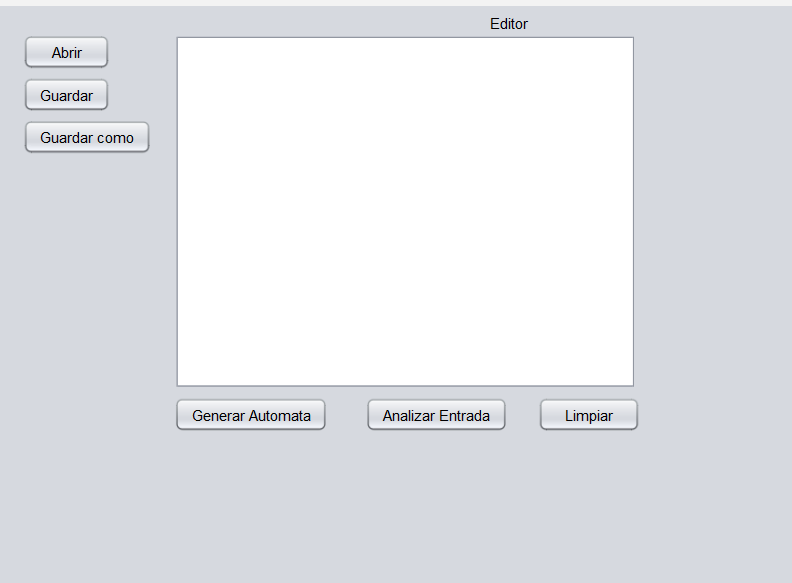
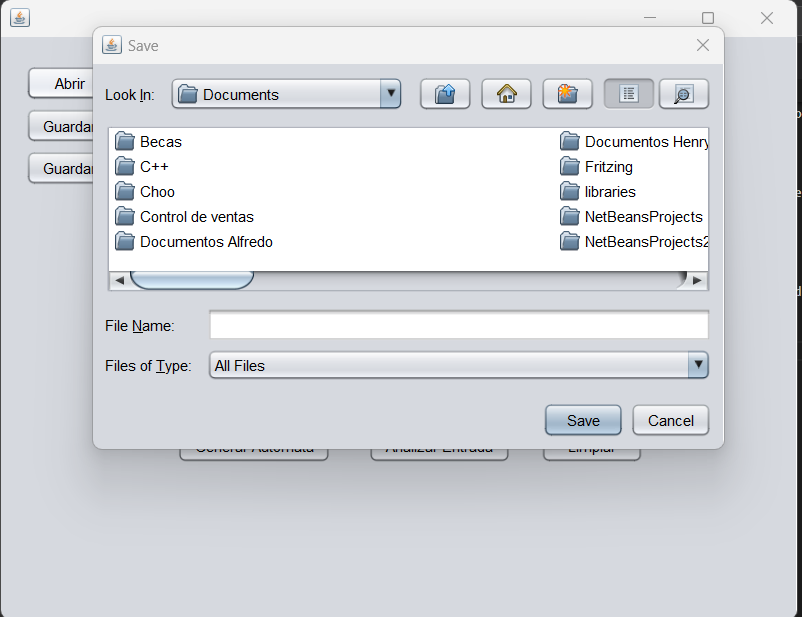
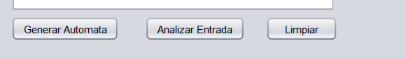

# **MANUAL DE USUARIO**

## EXREGAN

## **INDICE**- [**MANUAL DE USUARIO**](#manual-de-usuario)
- [**MANUAL DE USUARIO**](#manual-de-usuario)
  - [EXREGAN](#exregan)
  - [**INDICE**- **MANUAL DE USUARIO**](#indice--manual-de-usuario)
  - [**SOBRE EL PROGRAMA**](#sobre-el-programa)
  - [**REQUISITOS DEL SISTEMA**](#requisitos-del-sistema)
  - [**PROCESO DE USO**](#proceso-de-uso)

## **SOBRE EL PROGRAMA**
El programa tiene la finalidad de usar un analizador lexico y sintactico, analizando asi un archivo de tipo .olc, permitiendonos generar un automata, tablas siguientes, tablas de transicion, y nuestro automata AFD y poder verificar si una cadena sea valida por medio de una expresion.

## **REQUISITOS DEL SISTEMA**
Verifique que la computadora cumpla con los siguientes requisitos antes de usar el programa.

- Contar con un sistema operativo windows 7, 8, 8.1 o 10 u otro sistema operativo que permita usar java 
- Tener instalado java y jdk
- Tener un editor de codigo para pogramar(Visual Code, neatbeans, u otro editor )

## **PROCESO DE USO**
Para proceder al uso del programa se procedio a usar el editor de codigo Visual Studio Code.

Luego de haberse ejecutado se visualara un menu en el apartado de la consola de NeatbeansIDE

al ejecutar el archivo se abrira nuestro From

*
Si se presiona el boton de abrir nos permitira abrir un archivo olc y pegar el contendio en nuestra ventana editos

*

Si se preciona el boton de guardar nos permitira guardar  cualquier modificiacion a nuestro 
editor

Si se preciona el boton de guarda como nos permitira guardar  un archivo te tipo clo editor
*

se tienen los situeinte botones que nos permitiran realizar una accion

El boton de Generar Automata, nos genera nuestros arboles ABL, tabla de siguientes, tabla de transiciones, Automata AFD, Automata AFND

El boton de Analizar Entrada nos generara un archivo json donde verificar que cadenas son aceptadas por una expresion si es asi se confirmara en el archivo json que a sido valido correctamente.

El boton de Limpiar nos limpia la pantalla editor

